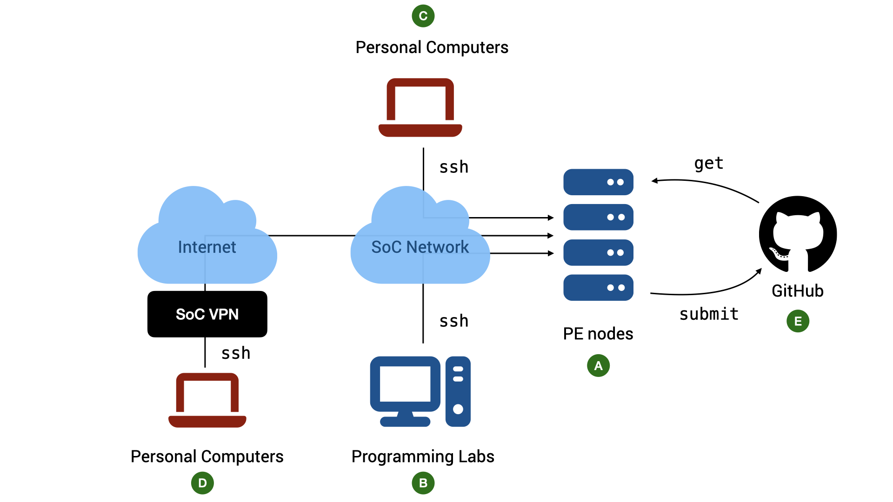
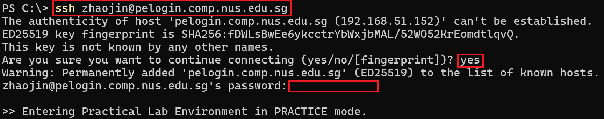

# The CS1010 Programming Environment


<div align="center">Figure 1: The CS1010 Programming Environment.  TL;DR: All work should be done on the PE nodes.  You can access the nodes via `ssh` through lab PCs or your personal devices.  If you need to access them outside SoC, you need to go through SoC VPN.</div>

## OS and Compiler

C is a common programming language.  You can find different implementations of a C compiler on many platforms.  Wikipedia [lists more than 40 different C compilers](https://en.wikipedia.org/wiki/List_of_compilers#C_compilers).  These different compilers support different processor architectures and operating systems and may behave slightly differently as well as support different features of C standards.  It is therefore important for CS1010 to stick to a single platform and single compiler.

Our platform of choice is **Ubuntu 24.4.** using the `clang` compiler (**version 18.0 or later**).

## PE Nodes

The school has provided a list of computing servers with the above environments for you to use (:material-alpha-a-circle: in Figure 1).  The nodes are accessible via `pelogin`.  (`pe` stands for "programming environment").  We will refer to these servers generally as the _PE nodes._

You will be automatically assigned to one of the nodes when you login.  You share the same home directory across all the nodes (this home directory, however, is different from that of `stu`).

For simplicity, the following guide uses `xcnd0`, which is one of the pe nodes, in all examples.

## Accessing PE Nodes

While you could complete your programming assignments on your own computers, the practical exams are done in a controlled environment using exam servers similar to the PE nodes.  It is therefore advisable for you to familiarize yourself with accessing the PE nodes via `ssh` and complete all your exercises on PE nodes.

### Account

Basic requirements:

1. To access the nodes, you need an SoC Unix account.  If you do not have one, you can [apply for one online](https://mysoc.nus.edu.sg/~newacct/).

2. Once you have an account, you need to [activate your access to the PE nodes](https://mysoc.nus.edu.sg/~myacct/services.cgi), which are part of the SoC computer clusters.

3. To access PE Nodes from your computer (:material-alpha-c-circle: or :material-alpha-d-circle: in Figure 1) you need

    - a command line `ssh` client.  Windows 10/11, macOS, and Linux users should already have `ssh` installed by default.  If your OS does come with `ssh` (i.e., it cannot find the `ssh` command when you type `ssh` into your terminal), look for instructions on how to install OpenSSH client on your operating system.
   - a [terminal emulator](unix-background.md#what-is-a-terminal).  The default terminal emulator that comes with Windows and Mac supports only basic features.  For Windows 10/11 users, CS1010 recommends either PowerShell (pre-installed) or [Windows Terminal](https://apps.microsoft.com/detail/9n0dx20hk701?ocid=webpdpshare).  For macOS users, CS1010 recommends [iTerm2](https://iterm2.com/).
   - For older versions of Windows, you can check out [XShell 7](https://www.netsarang.com/en/free-for-home-school/) (free for home/school use), or [PuTTY](https://www.putty.org).  These are GUI-based programs, so the command lines instructions below do not apply.

### The Command to SSH

You can access them remotely via `ssh` (Secure SHell).

To connect to a remote host, run the following in your terminal on your local computer:
```
ssh <username>@<hostname>
```

Replace `<username>` with your SoC Unix username and `<hostname>` is pelogin.comp.nus.edu.sg. For instance, I would do:
```
ssh zhaojin@pelogin.comp.nus.edu.sg
```

After the command above, follow the instructions on the screen.  

The first time you ever connect to `pelogin.comp.nus.edu.sg`, you will be warned that you are connecting to a previously unknown host.  Answer `yes`.  

After that, you will be prompted with your SoC Unix password.  Note that nothing is shown on the screen when your password is being entered.



### Accessing The PE Nodes from Outside SoC

The PE nodes can only be accessed from within the School of Computing networks.  If you want to access it from outside, you need to connect through SoC VPN (:material-alpha-d-circle: in Figure 1).

First, you need to set up a Virtual Private Network (VPN) (See [instructions here](https://dochub.comp.nus.edu.sg/cf/guides/network/vpn)).  The staff at the IT helpdesk in COM1, Level 1, will be able to help you with setting up if needed.  You can also contact them via the NUS IT RT system at [https://rt.comp.nus.edu.sg](https://rt.comp.nus.edu.sg).

!!! note "SoC VPN vs NUS VPN"

    Note that SoC VPN is different from NUS VPN.  Connecting to NUS VPN only allows you access to the NUS internal network, but not the SoC internal network.

### Accessing The PE Nodes from SoC Lab PCs

CS1010 practical exams will be conducted in the programming labs in COM1, COM4, and AS6 using the Ubuntu environment on the lab PCs.  Students are advised to use the lab PCs during regular lab sessions to familiarize themselves with the environment (:material-alpha-b-circle: in Figure 1).  

To access the PE nodes from the lab PCs during lab sessions:

- Boot into Ubuntu if the PC is not already running Ubuntu
- Log into the PC using the SoC Unix account
- Launch the terminal and use `ssh` command above.

!!! warning
    The local home directory on the lab PCs will be cleaned regularly.  _Do not expect that files stored in the lab PCs to be persistent_.  You can copy your files to external drive, to your home directory on the PE nodes, or to a cloud storage.
    
## Copying Files between PE Nodes and Local Computer

Secure copy, or `scp`, is one way to transfer files between the programming environments and your local computer.   `scp` behaves just like `cp` (see [Unix: Essentials](unix-essentials.md)).  The command takes in two arguments, the source and the destination.   The difference is that we use the `<username>@<hostname>:<filename>` notation to specify a file on a remote host.

Let's say you want to transfer a set of C files from the directory `a01` to your local computer, then, on your local computer.  You run:

```bash
scp zhaojin@xlogin.comp.nus.edu.sg:~/a01/*.c .
```

!!! note "pelogin" vs "xlogin"

	Note that scp is disabled on pelogin. That why xlogin is used here instead. 

	Despite some differences in the setup, the two servers share a few similarties including the login credentials and the user home directories. If you copy a file to xlogin, you will be able to access the file in pelogin as well.

!!! warning
    If you have files with the same name in the remote directory, the files will be overwritten without warning.  I have lost my code a few times due to `scp`.  

The expression `*.c` is a regular expression that means all files with filename ending with `.c` (see [Advanced Topics on Unix](unix-advanced.md)).
You can copy specific files as well.  For instance, to copy the file `hello.c` from your local computer to your `~/a01` directory:

```bash
scp hello.c zhaojin@xlogin.comp.nus.edu.sg:~/a01
```

`scp` supports `-r` (recursive copy) as well.

Note that we always run `scp` on your local computer in the examples above, since the SSH server runs on the PE nodes.

## Setting up Password-less Login for the PE Node

The next step is not required but is a time-saver and a huge quality-of-life improvement.  You need to be familiar with basic Unix commands, including how to copy files to remote hosts (using `scp`) and how to check/change file permissions (using `ls -l` and `chmod`).  If you are still not comfortable with these commands, make sure you play with the [basic Unix commands](unix-essentials.md) first.  You can come back and complete this step later. 

### Basic of SSH Keys

SSH uses _public-key cryptography_ for authentication.  The keys come in pairs: a public key and a private key.  The private key must be kept safe and known only to you.  You should keep the private key in your PE account, and not share it with others.

To authenticate yourself to another host or service, you configure the host/service with your public key.  When it is time for you to log in, your private key is "matched"[^1] with your public key.  Since only you know your private key, the service or the host can be sure that you are you and not someone else.

Suppose you want to log in from host _X_ to host _Y_ without a password.  You generate a pair of keys on _X_, then keep the private keys on _X_ and store the public keys on _Y_.  

For example, you can generate the pair of keys on your computer (e.g., _X_) and then copy the public key to the CS1010 PE node (_Y_). 

Afterwards, you will be able to log into the PE node from your computer without a password, 

### Generating SSH Keys
To do so, you can use the following command on your local computer:

```
ssh-keygen -t rsa
```

The command will prompt you where to save the key.  Just press ++enter++ to save into the default location.

You will then be prompted for a passphrase.  Since our goal is to connect to the PE node without needing to type anything,
you should enter an empty passphrase.  This increases the security risk, but then, we are working with CS1010 exercises here, not a
top-secret project.  So an empty passphrase will do. 

You should see something like this:
```
Generating public/private rsa key pair.
Enter file in which to save the key (<path-to-private-key>):
Enter passphrase (empty for no passphrase):
Enter same passphrase again:
Your identification has been saved in <path-to-private-key
Your public key has been saved in <path-to-public-key>
The key fingerprint is:
...
The key's randomart image is:
...
```

Take note of the <path-to-public-key> which shows path to the public key on the local machine.

### Adding the Public Key to the PE Node
[Copy](environments.md#copying-files-between-pe-nodes-and-local-computer) the public key `id_rsa.pub` to your home directory on `xlogin` using `scp`. 

The command should look like 

```
scp <path-to-the-key> <username>@xlogin.comp.nus.edu.sg:~/
```

After copying, ssh into `pelogin` and run
```
cat id_rsa.pub >> ~/.ssh/authorized_keys
```

If there are permission errors, make sure that the permission for the directory `.ssh` both on the local machine and on the PE node is set to `700` and the files `id_rsa` on the local machine and `authorized_keys` on the pe node are set to `600`.  Once set up, you need not enter your password every time you run `ssh` or `scp`.  

!!! Tips "For Windows Users"
    On Windows, the equivalent of `chmod` is `icacls`.  While the default permission should work without you doing anything, but if needed, you can change the permission with

    ```
    icacls <path> /grant:r "<username>:F"   
    ```
	
### Checking Your Authentication Settings
To check if you can connect to the PE node using SSH keys, simply exit the PE node and try connecting to it again.

If everything is set up correctly, you will be able to login without a password.

## Stability of Network Connection
    
Note that a stable network connection is required to use the PE nodes for a long period without interruption.   If you encounter frequent disconnections while working at home or on campus while connected wirelessly, please make sure that your Wi-Fi signal is strong and that there is no interference from other sources. 

If your connection is disconnected in the middle of editing, `vim` saves the state of the buffer for you.  See the section on [recovery file](https://nus-cs1010.github.io/2425-s1/guides/vim-operations.html#swap-files) on how to recover your files.

If you experience frequent disconnection, you can consider running `screen`. After logging into a PE node, run:

```
screen
```

You will see some messages, press ++enter++ to go to the command prompt. You can now use the PE node as usual. In case you are disconnected (e.g., in the middle of editing), you can log into the same PE node again, and run:

```
screen -r
```

to resume your previous session.


## Troubleshooting

Suppose you try to connect to `pelogin` using:
```
ssh zhaojin@pelogin.comp.nus.edu.sg
```
and you get the following error:

1. `ssh: Could not resolve hostname pelogin.comp.nus.edu.sg`

	`ssh` cannot recognize the name `pelogin`, it is likely that you are not connected to the SoC VPN.

2. `Connection closed by 192.168.48.xxx port 22`

    You have connected to the PE node, but you are kicked out because you have no permission to use the node.

	Make sure you have activated your access to "SoC computer clusters" here: https://mysoc.nus.edu.sg/~myacct/services.cgi

3. `Permission denied, please try again`

    You did not enter the correct password or username.  Please use the username and password of your SoC Unix account which you have created here: https://mysoc.nus.edu.sg/~newacct/.

    Check that you have entered your username correctly.  It is _case-sensitive_.

    If you have lost your password, go here: https://mysoc.nus.edu.sg/~myacct/resetpass.cgi

4. `Could not chdir to home directory /home/o/zhaojin: Permission denied`

    This error means that you have successfully connected to the PE nodes, but you have no access to your home directory. 

	This should not happen.  Please submit a IT service request with the above error message via [https://rt.comp.nus.edu.sg](https://rt.comp.nus.edu.sg), including the PE hosts that you
	connected to with this error and your username.  The system administrator can reset the permission of your home directory for you.

[^1]: I skipped many cool details here.  This topic is part of CS2105 and CS2107.  Interested students can search for various articles and videos online about how public-key cryptography is used for authentication.
