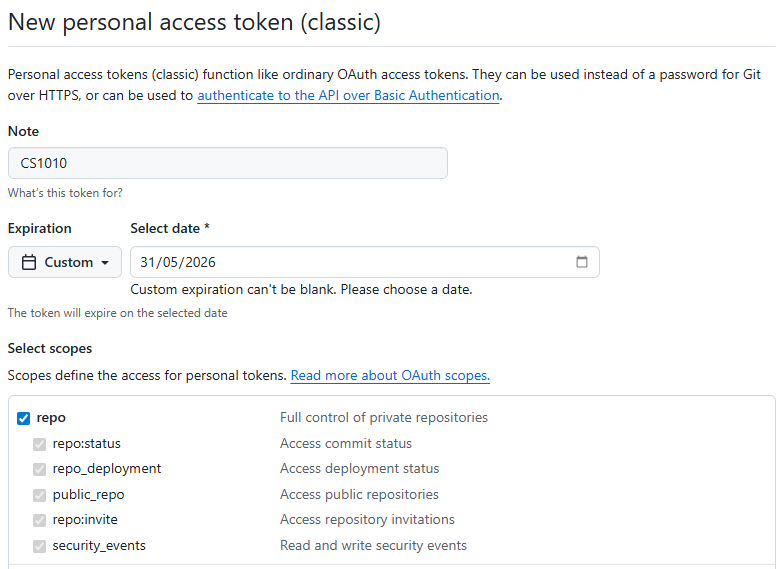
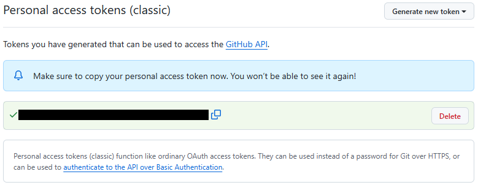
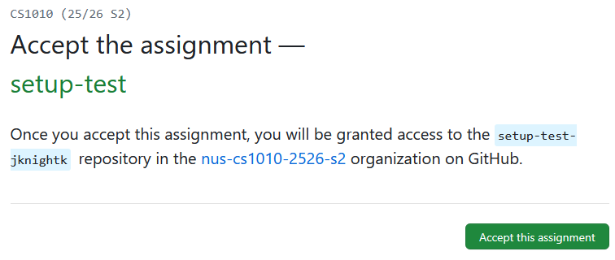
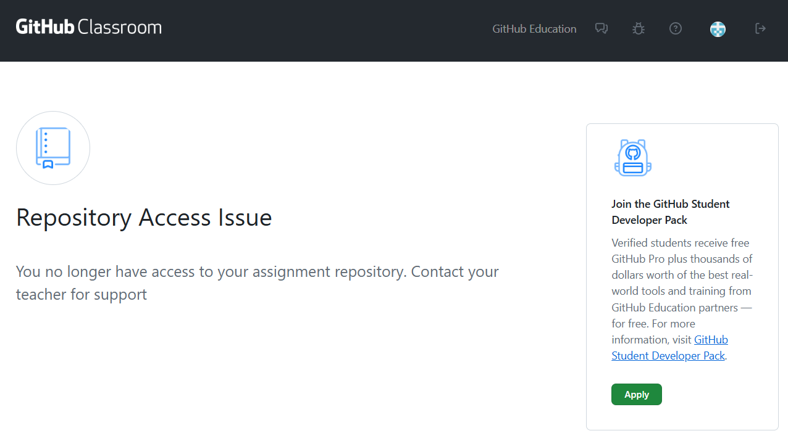

# Linking Your PE Account to Your GitHub Account

## Prerequisites

1. You should already have your SoC Unix account, cluster access, and SoC VPN set up, and be able to `ssh` into one of the CS1010 PE nodes.  If you are not able to do this, please look at the guide on [CS1010 programming environments](environments.md)
2. You should feel comfortable running basic Unix commands.  If you have not gone through the Unix guide and got your hands dirty, please [look at the guide and play with the various basic Unix commands](unix-essentials.md).
3. You should already have a GitHub account and can log into [GitHub.com](https://www.github.com).
4. You know how to create and edit a file in Vim.
5. {++You have [set up Vim](vim-setup.md).++}

## Purpose
You will be using `git` (indirectly) for retrieving skeleton code and submitting completed assignments.  We will set up your accounts on PE hosts below so that `git` will be associated with your GitHub account.  This is a one-time setup.  You don't have to do this for every assignment.

## 1. Setting up `.gitconfig`

Create and edit a file called `.gitconfig` in **your home directory on the PE host**, with the following content:

```text
[user]
  name = Your Name
  email = Your Email
[github]  
  user = Your GitHub Username
```

Your email should be whatever you used to sign up on GitHub (which may not be your SoC or NUS email).

For example, a sample `.gitconfig` looks like this:

```text
[user]
  name = Elsa
  email = queen@arendelle.gov
[github]  
  user = elsasnow16
```

After saving this file, run:

```
git config --get github.user
```

It should return your GitHub username.

It should print your GitHub username as already set.  If there is a typo, you need to edit `.gitconfig` again and reload it by repeating the command above.

## 2. Setting up Password-less Login for Github


### Generating Personal Access Token

The steps are explained in detail on [GitHub Docs](https://docs.github.com/en/authentication/keeping-your-account-and-data-secure/managing-your-personal-access-tokens).  Here is a summary of the steps that you should follow for CS1010:

- After logging into GitHub.com: click on your avatar in the top right corner, choose "Settings" from the menu, and choose "Developer settings" on the sidebar.

- Then, click on "Personal access tokens" on the sidebar and choose "Tokens (classic)".

- Next, click on "Generate new token" from the main panel and choose "Generate New Token (classic)". You will be asked to authenticate yourself.

After authentication, you will be redirected to the page for creating the token as shown below.



- Enter a note (e.g., CS1010) so that you can remember what the token is for.

- For expiration, set a custom date after the end of the semester (e.g., 31 May 2026) so that you do not need to recreate / extend the token.

- For scopes, Select only "repo", which is sufficient for CS1010.

- Click on generate token at the bottom of the page to create the token.

You will see the generated token on the screen as shown below: 



(The generated token is the string covered by the black bar in the figure.)

Use the copy button on the right of the black bar to copy it to your clipboard. 

You should save the copied token by pasting it somewhere private for your own keeping.

## 3. Saving your credentials through an empty lab assignment

We have created an empty lab assignment for you so that you can save your Github credentials on the PE node and test if you can correctly retrieve future lab files from GitHub.  Complete the following steps:

- Click here [https://classroom.github.com/a/VUiU0aBy](https://classroom.github.com/a/VUiU0aBy).  

(You will be required to login to Github if you have not done so. In addition, if you see a page asking you to select yourself from a list, simply click "Skip to the next step".)

You should see a page that looks like the following:

{: style="width:500px"}

- Click the accept button.  Wait a bit and then refresh until you see a "You're ready to go" message.



If you encounter the reposity access issue page, it is likely that you need to accept the email invitation from Github so that you have proper access to the repo.

(Note that the email is send to your email associated with Github and may have landed in your spam.)

Please accept the invitation via that email as well before you proceed to the remaining steps.

- Now, on the PE node, run the following command so that your username and personal access token will be saved upon your next Github login.

```
git config --global credential.helper store
```

- Next, run `get` script from the cs1010 directory so that the empty lab assignment will be set up and a Github login will be triggered.

```
/opt/course/cs1010/get setup-test
```

- When prompted for a username, enter your GitHub username.

- When prompted for a password, copy your personal token into the clipboard and go back to the terminal window.

- Simply right click to paste the token into the window (the token won't be shown) and press ++enter++.
 
If everything works well, you should see:

```
Cloning into '/tmp/tmp.<some-random-text>'...
remote: Enumerating objects: 3, done.
remote: Counting objects: 100% (3/3), done.
remote: Compressing objects: 100% (2/2), done.
remote: Total 3 (delta 0), reused 2 (delta 0), pack-reused 0
Receiving objects: 100% (3/3), done.
```

Change your working directory into `setup-test-<username>` and look at the directory content.  It should contain a file `README.md`. 

From this point onwards, you should be able to use git without having to enter your credentials.

{++If you see the message "Vim is not set up set up properly," please refer to the our [Vim setup guide](vim-setup.md) and set up Vim accordingly.++}

## 4. Adding the cs1010 directory to your bash profile as one of the default paths
To simplify the workflow further, you can use vim to create / edit the file .bash_profile in your home directory.

Add this line at the end of the file, save the file and exit vim.

```
export PATH="$PATH:/opt/course/cs1010"
```

Back at the unix command prompt, run ```source ~/.bash_profile```

Afterwards, you should be able to run the `get` script without having to indicate the cs1010 directory.

```
get setup-test
```


